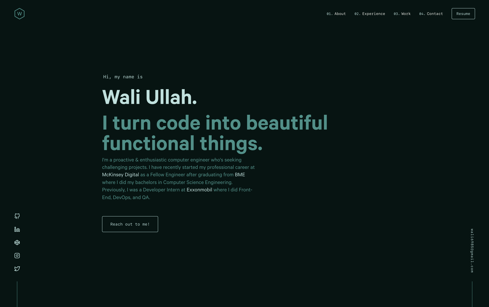

<div align="center">
  
</div>
<h1 align="center">
  waliullah.dev
</h1>

<p align="center">
  Personal portfolio website, built with <a href="https://www.gatsbyjs.org/" target="_blank">Gatsby</a> and hosted on <a href="https://www.netlify.com/" target="_blank">Netlify</a>.
</p>
</p>

<p align="center">
  <a href="https://app.netlify.com/sites/waliullah/deploys" target="_blank">
    
  </a>
</p>




## 🛠 Installation & Set Up

1. Install the Gatsby CLI

   ```sh
   npm install -g gatsby-cli
   ```

2. Install and use the correct version of Node using [NVM](https://github.com/nvm-sh/nvm)

   ```sh
   nvm install
   ```

3. Install dependencies

   ```sh
   yarn
   ```

4. Start the development server

   ```sh
   npm start
   ```

## 🚀 Building and Running for Production

1. Generate a full static production build

   ```sh
   npm run build
   ```

1. Preview the site as it will appear once deployed

   ```sh
   npm run serve
   ```
   
---

### Inspiration

Design inspired by [brittanychiang.com](https://brittanychiang.com).
